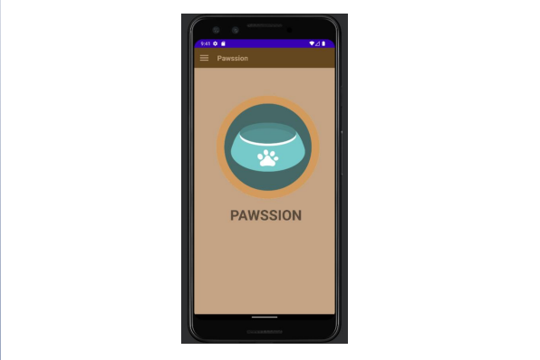
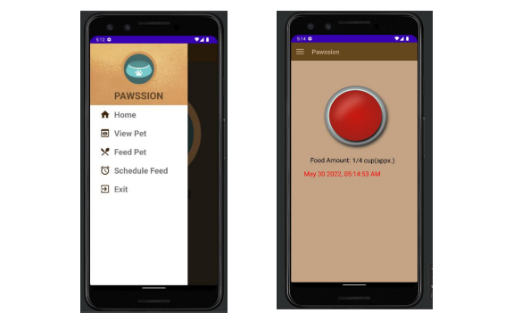
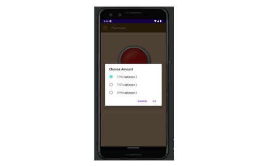
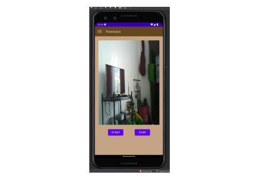
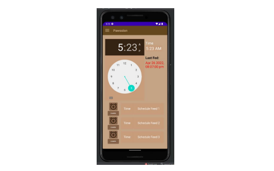

# Mobile App for PAWSSION: An Android-Based Smart Dog Cage With Management and Monitoring System

**Application Development.**

## Main Application

The application development project comprised of three components: a Java-based Android Studio, a real-time database powered by Firebase, and a NodeMCU.
The application had five (5) designated submenus each for different purpose. Picture above shows the main application page.
The Firebase database must be imported in Android Studio and must be connected to Arduino UNO

The activity view is the first view that the user sees after launching the application. It may have a variety of controls, including buttons, labels, and images. Typically, a single app has a number of Activities. All Activities are deleted from memory immediately upon application closure.

## Menubar & Feed Pet

The first picture to the left displays the menu icons on the homepage when the three horizontal lines in the page's upper left corner once clicked.
The page provided options for selecting the application to launch when the current one completes. The available options are to return
to the homepage, view the pet, feed the pet, and set the pet's feeding schedule.

The second picture show the Feed Now page and a modal. Feed Now page had a red button in the middle and showed the last fed activity. The button used an
OnClickListener element so when clicked, the object receives an on-click event.

## Amount Selection

This displays a pop-up menu that allows the user to select three projected serving sizes in cups for the dog's food: 1/4 cup, 1/2 cup, and 3/4 cup.
These dimensions were displayed in the figure. It was equivalent to 1 1/2 cups, which was the amount suggested by veterinarians.

## Camera View

This depicts the camera view page, which includes the camera frame. Within the camera frame, there are two buttons that the user can activate to cause the camera to
"Start" viewing the pet, and the "Stop" option can be used to cause the camera to stop viewing the pet inside the cage.

## Schedule

For the Schedule page, it included a Schedule button that displayed a modal window with a timePicker. This component would allow the user to
select the timing for the next feeding. The user has the option of saving that time or canceling/closing the modal. When the user clicks "OK," a request to the server is sent to start the machine at the specified time. Even after setting up a time of feed the user can still cancel the scheduled time.

## PAWSSION: AN ANDROID-BASED SMART DOG CAGE WITH MANAGEMENT AND MONITORING SYSTEM FOR RESPONSIBLE PET OWNERS.

By: Arada, Yves Lemuel A., Francisco, Jasmine G., Lerio, Kyle R., Parawan, Shyriel May P., Salgon, Ruth L.

May 2022

**A Capstone Project presented to The Faculty of College of Engineering, Architecture, and Technology Rizal Technological University City of Mandaluyong.**

